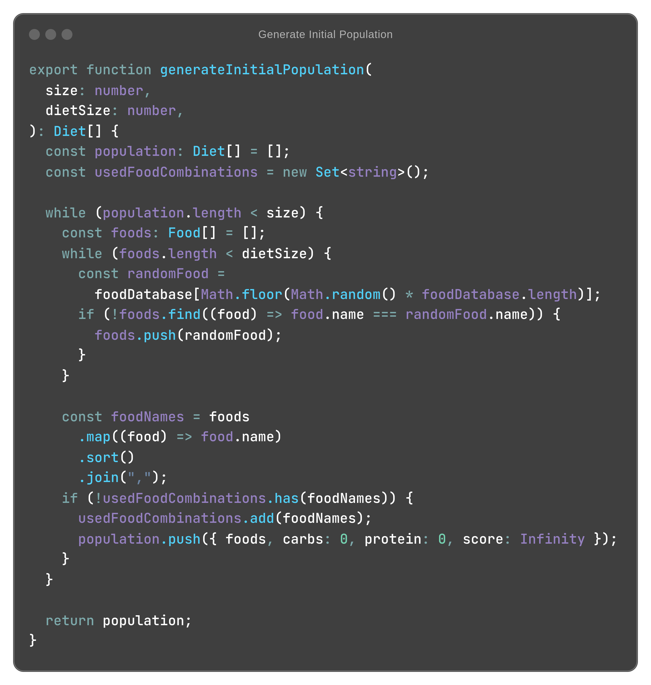
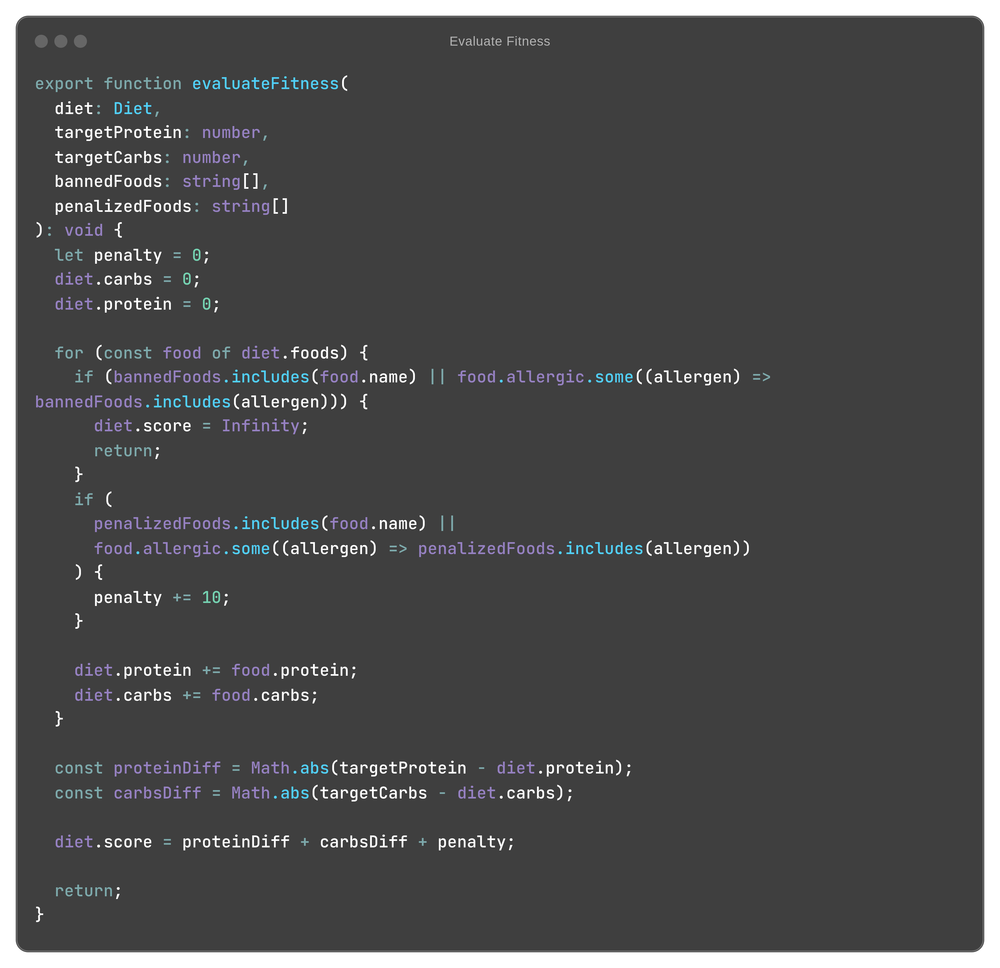
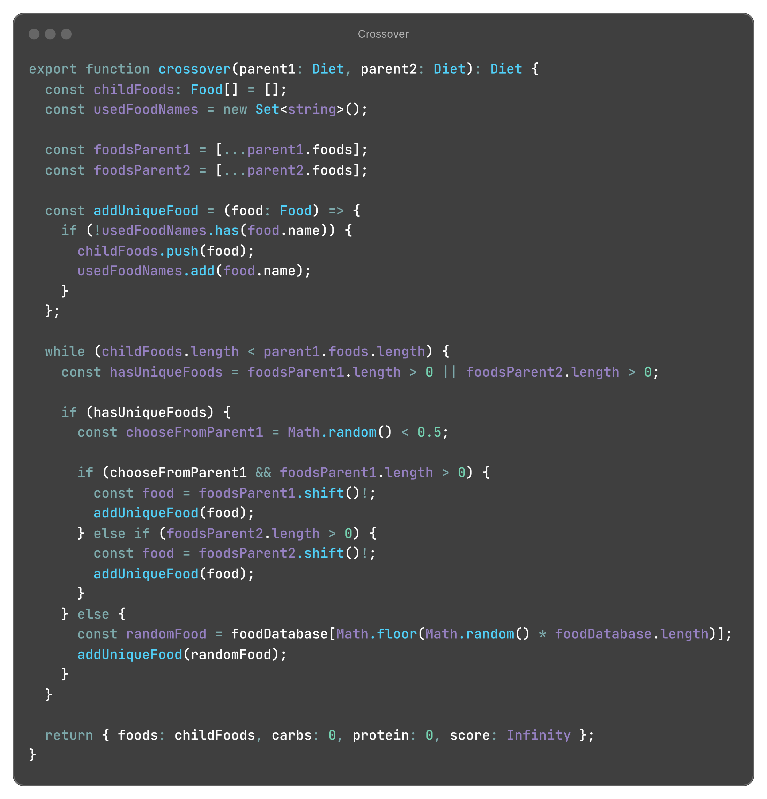
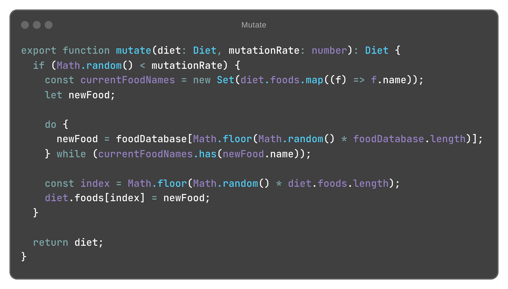
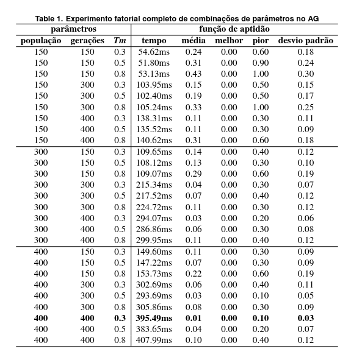
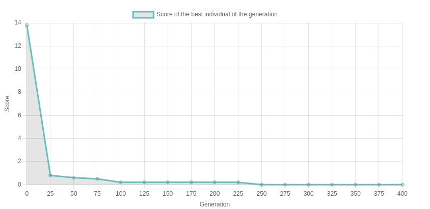
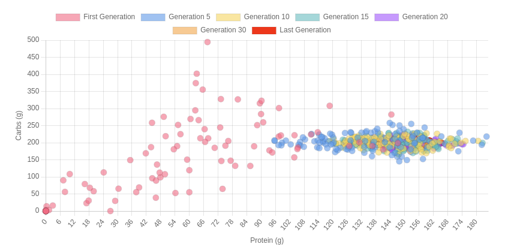
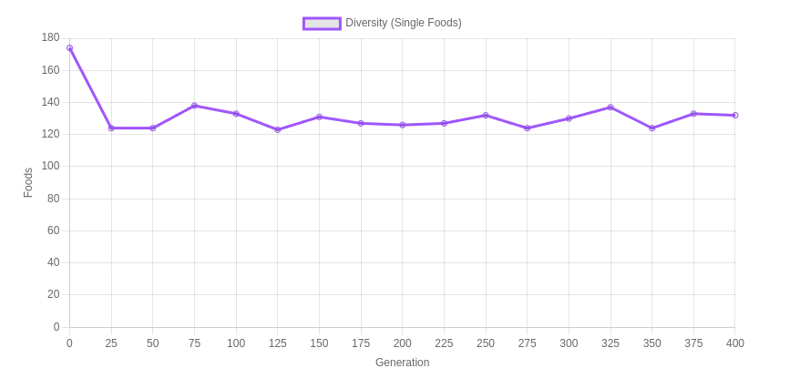

# GA Diet Optimizer | Otimizador de Dietas com Algoritmo Genético

## 📌 Informação Geral do Projeto | General Project Information

Este repositório contém a implementação de um **Algoritmo Genético (AG)** para a otimização de dietas personalizadas, considerando restrições nutricionais e alimentares. O sistema recebe como entrada as quantidades desejadas de **proteínas** e **carboidratos**, além de **restrições** (como alimentos proibidos por alergia ou indesejados). A partir dessas informações, o algoritmo evolui uma população de soluções, retornando a melhor dieta possível.

This repository contains the implementation of a **Genetic Algorithm (AG)** for personalized diet optimization, taking into account nutritional and dietary constraints. The system receives as input the desired amounts of **proteins** and **carbohydrates**, along with **restrictions** (e.g., foods banned due to allergies or unwanted). Based on these inputs, the algorithm evolves a population of candidate solutions, returning the best possible diet.

- **Objetivo | Objective:**  
  Otimizar a criação de dietas personalizadas que atendam aos requisitos nutricionais do usuário, minimizando diferenças entre os valores desejados e os obtidos, além de penalizar alimentos indesejados.

  Optimize the creation of personalized diets that meet the user's nutritional requirements, minimizing differences between desired and achieved values, in addition to penalizing unwanted foods.

- **Tecnologias Utilizadas | Technologies Used:**  
  - TypeScript  
  - Node.js  
  - Chart.js (para geração dos gráficos)

- **Estrutura do Projeto | Project Structure:**

    ```text
    📦src
    ┣ 📂data
    ┃ ┗ 📜foodDatabase.ts
    ┣ 📂experiments
    ┃ ┗ 📜index.ts
    ┣ 📂genetic
    ┃ ┗ 📜geneticAlgorithm.ts
    ┣ 📂models
    ┃ ┣ 📜Diet.ts
    ┃ ┣ 📜Food.ts
    ┃ ┗ 📜GeneticAlgorithmResult.ts
    ┣ 📜index.html
    ┗ 📜index.ts
    ```

---

## 🧬 Apresentação do Problema e do Algoritmo Genético | Problem Statement and Genetic Algorithm

- **Problema | Problem:**
  
  O desafio é encontrar uma dieta que atenda aos valores nutricionais ideais (proteínas e carboidratos) e respeite restrições (alimentos proibidos ou penalizados), dentre uma grande variedade de possíveis combinações. Uma busca exaustiva seria inviável, dada a complexidade combinatória do problema.
  
  The challenge is to find a diet that meets the ideal nutritional values (proteins and carbohydrates) while respecting restrictions (banned or penalized foods) from a large number of possible combinations. An exhaustive search is impractical due to the combinatorial complexity.

- ⚙️ **Algoritmo Genético | Genetic Algorithm:**
  
  O AG é uma técnica inspirada na evolução natural, que utiliza processos de **seleção**, **crossover** e **mutação** para evoluir uma população de soluções. No nosso projeto:
  
  GA is a technique inspired by natural evolution, which uses **selection**, **crossover** and **mutation** processes to evolve a population of solutions. In our project:

- 👥 **Geração Inicial | Initial Generation:** 
  
  São geradas dietas aleatórias, garantindo a unicidade dos alimentos em cada dieta e também garantindo que cada dieta tenha uma combinação de alimentos única.
  
  Random diets are generated, ensuring the uniqueness of foods in each diet and also ensuring that each diet has a unique combination of foods.
  

- 📊 **Avaliação de Aptidão (Fitness) | Fitness Assessment:**
  
  Cada dieta é avaliada com base na diferença absoluta entre os valores nutricionais desejados e os obtidos, acrescida de penalidades para alimentos proibidos. A dieta que apresenta um score menor é considerada melhor, com a solução ótima tendo score 0.0.
  
  Each diet is assessed based on the absolute difference between the desired and achieved nutritional values, plus penalties for prohibited foods. The diet that has a lower score is considered better, with the optimal solution having a score of 0.0.
  

- 🎯 **Seleção | Selection:**
  
  A seleção dos indivíduos é realizada ordenando-se a população pelo score (melhor aptidão) e selecionando a metade com melhor desempenho para formar a próxima geração.

  The selection of individuals is carried out by ordering the population by score (best fitness) and selecting the half with the best performance to form the next generation.
  

- 🔄 **Crossover e Mutação | Crossover and Mutation:**
  
  São aplicados para combinar e modificar soluções, promovendo a diversidade e a exploração do espaço de soluções.

  They are applied to combine and modify solutions, promoting diversity and exploration of the solution space.
  
  

---

## 🛠️ Instalação | Installation

Para rodar este projeto, siga os passos abaixo:
\
To run this project, follow the steps below:

1. **Clone o repositório | Clone the repository:**

    ```bash
    git clone https://github.com/Rondleysg/ga-diet-optimizer.git
    cd ga-diet-optimizer
    ```

2. **Instale as dependências | Install dependencies:**

    ```bash
    npm install
    ```

---

## 🚀 Utilização | Usage

### Configuração do Algoritmo

Antes de executar o algoritmo, é necessário configurar os objetivos e parâmetros. Para isso, abra o arquivo `src/index.ts` e ajuste as seguintes variáveis:

- **targetProtein**: Número de proteínas desejado na dieta.
- **targetCarbs**: Número de carboidratos desejado na dieta.
- **allergies**: Array com os alimentos que serão banidos da dieta (ex.: `["LEITE"]`).
- **penalizedFoods**: Array com os alimentos que causarão penalidades (ex.: `["SOJA"]`).
- **generateCharts**: Defina como `true` se quiser que os gráficos sejam gerados ou `false` para visualizar apenas os resultados no console.
- Você também pode personalizar outros parâmetros, como a **taxa de mutação**, **quantidade de gerações**, **tamanho da dieta** e o **tamanho da população**, diretamente neste arquivo.

### Comandos de Execução

- **Executar Experimentos (Bateria de Testes):** Este comando executa uma série de testes (experimentos) para testar diferentes parâmetros do algoritmo, repetindo cada configuração várias vezes para permitir a coleta de métricas estatísticas.
  
    ```bash
    npm run experiments
    ```

- **Build de Produção (para Visualizar Gráficos):** Após a compilação, abra o arquivo HTML gerado (`dist/index.html`) no navegador para visualizar os gráficos resultantes.
  
    ```bash
    npm run build-prod
    ```

- **Executar Algoritmo no Modo de Desenvolvimento (Console):** Este comando executa o algoritmo e exibe os resultados no console, útil para testes rápidos e verificação de saídas numéricas.
  
    ```bash
    npm run dev
    ```

### Algorithm Configuration

Before running the algorithm, it is necessary to configure the objectives and parameters. To do this, open the `src/index.ts` file and adjust the following variables:

- **targetProtein**: Desired number of proteins in the diet.
- **targetCarbs**: Desired number of carbohydrates in the diet.
- **allergies**: Array with the foods that will be banned from the diet (e.g.: `["LEITE"]`).
- **penalizedFoods**: Array with the foods that will cause penalties (e.g.: `["SOJA"]`).
- **generateCharts**: Set to `true` if you want the graphs to be generated or `false` to only view the results in the console.
- You can also customize other parameters, such as the **mutation rate**, **number of generations**, **diet size** and **population size**, directly in this file.

### Execution Commands

- **Run Experiments (Test Batch):** This command runs a series of experiments to test different parameters of the algorithm, repeating each configuration multiple times to allow the collection of statistical metrics.

    ```bash
    npm run experiments
    ```

- **Production Build (to View Graphs):** After the build, open the generated HTML file (`dist/index.html`) in the browser to view the resulting graphs.

    ```bash
    npm run build-prod
    ```

- **Run Algorithm in Development Mode (Console):** This command runs the algorithm and displays the results in the console, useful for quick testing and checking numerical outputs.

    ```bash
    npm run dev
    ```

---

## 📊 Resultados

Para avaliar a eficácia do algoritmo, realizamos diversos experimentos com diferentes configurações de parâmetros. Todos os testes foram executados em um sistema com processador AMD Ryzen 5 5600g (3.9 GHz) e 16 GB de memória RAM, rodando Linux. Devido à natureza estocástica do AG, cada configuração experimental foi executada 20 vezes, permitindo o cálculo de métricas como **média**, **melhor valor**, **pior valor** e **desvio padrão do fitness**, além do **tempo de execução médio**. Os resultados são apresentados na tabela abaixo:


Abaixo estão outros experimentos que foram conduzidos utilizando a configuração final de **400 indivíduos, 400 gerações e 0.3 de taxa de mutação**. As execuções foram repetidas diversas vezes e os resultados são apresentados nos seguintes gráficos:

- **Evolução do Fitness do Melhor Indivíduo**:
    Este gráfico mostra a evolução do score do melhor indivíduo em cada geração, evidenciando uma rápida melhoria nos primeiros ciclos seguida por uma estabilização conforme o algoritmo converge para soluções ótimas.
    

- **Gráfico de Dispersão dos Indivíduos**:
    Aqui, cada ponto representa um indivíduo (dieta) plotado em função de proteínas (eixo X) e carboidratos (eixo Y) para gerações selecionadas. O gráfico ilustra como a população inicialmente dispersa converge para uma região que atende aos valores nutricionais alvo.
    

- **Evolução da Diversidade Populacional**:
    Este gráfico apresenta a quantidade de alimentos distintos (single foods) presentes na população ao longo das gerações, demonstrando que, mesmo com intensa seleção, a diversidade é mantida em patamares estáveis.
    

Todos os gráficos foram gerados automaticamente pelo sistema, você também pode gerar e visualizar os gráficos no seu navegador, basta configurar a variável `generateCharts` como `true` no arquivo `src/index.ts`.

## 📊 Results

To evaluate the effectiveness of the algorithm, we performed several experiments with different parameter configurations. All tests were performed on a system with an AMD Ryzen 5 5600g processor (3.9 GHz) and 16 GB of RAM, running Linux. Due to the stochastic nature of the GA, each experimental configuration was run 20 times, allowing the calculation of metrics such as **mean**, **best value**, **worst value** and **standard deviation of fitness**, in addition to the **average execution time**. The results are presented in the table below:


Below are other experiments that were conducted using the final configuration of **400 individuals, 400 generations and 0.3 mutation rate**. The runs were repeated several times and the results are presented in the following graphs:

- **Evolution of the Fitness of the Best Individual**:
This graph shows the evolution of the score of the best individual in each generation, showing a rapid improvement in the first cycles followed by a stabilization as the algorithm converges to optimal solutions.


- **Scatter Plot of Individuals**:
Here, each point represents an individual (diet) plotted as a function of proteins (X-axis) and carbohydrates (Y-axis) for selected generations. The graph illustrates how the initially dispersed population converges to a region that meets the target nutritional values. 

- **Evolution of Population Diversity**:
This graph shows the amount of distinct foods (single foods) present in the population over generations, demonstrating that, even with intense selection, diversity is maintained at stable levels.


All graphs were generated automatically by the system. You can also generate and view the graphs in your browser by setting the `generateCharts` variable to `true` in the `src/index.ts` file.